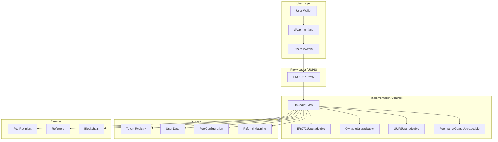
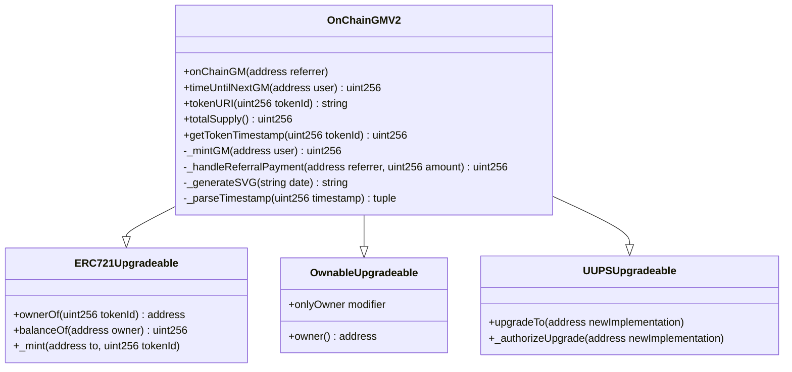
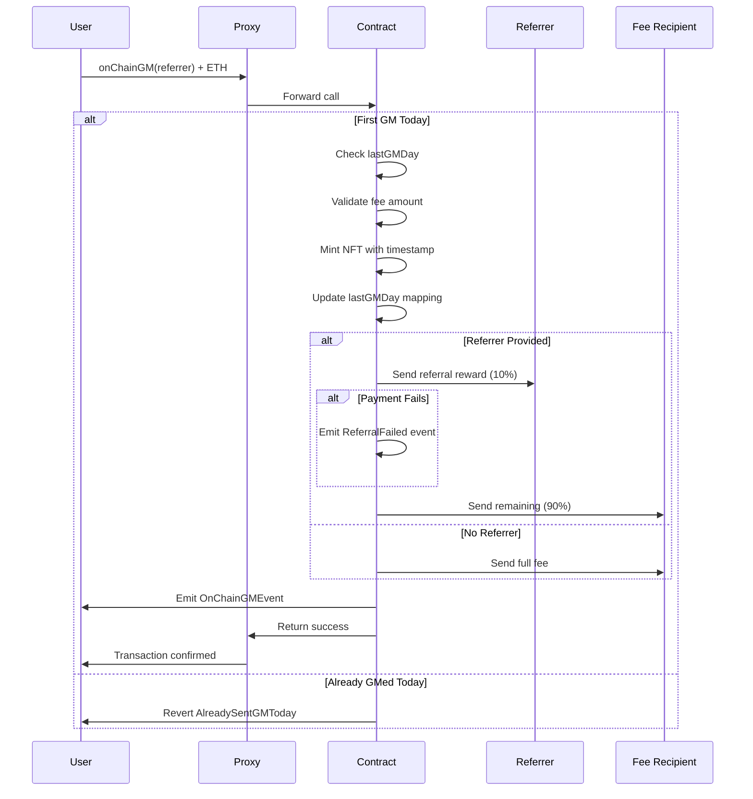
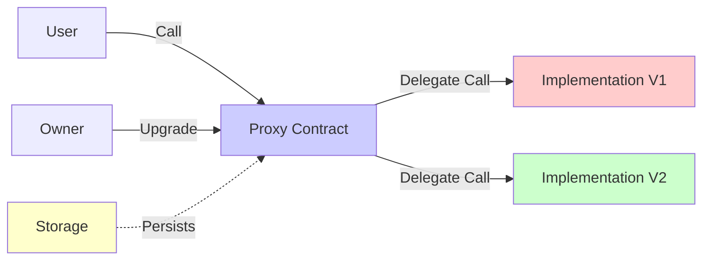

# 🌞 OnChainGM V2.0 - Comprehensive Documentation

<div align="center">

[](https://soliditylang.org/)
[](LICENSE)
[](https://openzeppelin.com/)
[](https://hardhat.org/)

**Your Daily Web3 Ritual - Upgradeable NFT Edition**

[Features](#-features) • [Architecture](#-architecture) • [Quick Start](#-quick-start) • [Documentation](#-documentation) • [Security](#-security-considerations)

</div>

---

## 📋 Table of Contents

- [Executive Summary](#-executive-summary)
- [What is OnChainGM?](#-what-is-onchaingm)
- [Version 2.0 Highlights](#-version-20-highlights)
- [Architecture](#-architecture)
  - [System Architecture](#system-architecture)
  - [Contract Structure](#contract-structure)
  - [Data Flow](#data-flow)
  - [Storage Layout](#storage-layout)
- [Features](#-features)
  - [Core Features](#core-features)
  - [NFT System](#nft-system)
  - [Referral System](#referral-system)
  - [Upgradeability](#upgradeability)
- [Technical Specifications](#-technical-specifications)
  - [Smart Contract Details](#smart-contract-details)
  - [ERC-721 Compliance](#erc-721-compliance)
  - [UUPS Proxy Pattern](#uups-proxy-pattern)
- [Fee Structure](#-fee-structure)
- [API Reference](#-api-reference)
  - [Public Functions](#public-functions)
  - [View Functions](#view-functions)
  - [Owner Functions](#owner-functions)
  - [Events](#events)
- [Deployment Guide](#-deployment-guide)
- [Conclusion](#-conclusion)

---

## 🎯 Executive Summary

**OnChainGM V2.0** is an innovative Ethereum smart contract that combines the ritualistic daily "Good Morning" (GM) transaction with NFT minting capabilities. Built on a robust upgradeable architecture using the UUPS proxy pattern, this contract enables users to mint unique, date-stamped NFTs every day while supporting a referral reward system.

### Key Value Propositions

- ✅ **Daily Engagement**: One GM transaction per day creates a sustainable Web3 habit
- ✅ **NFT Collection**: Every GM mints a unique, non-transferable GMCard NFT
- ✅ **On-Chain Art**: Dynamic SVG generation creates beautiful NFT images with date stamps
- ✅ **Referral Rewards**: 15% discount for users, 10% reward for referrers
- ✅ **Upgradeable**: Future-proof architecture allows contract improvements
- ✅ **Gas Efficient**: Optimized storage and operations minimize transaction costs
- ✅ **Fully On-Chain**: No external dependencies, complete decentralization

---

## 🌟 What is OnChainGM?

OnChainGM transforms the Web3 community tradition of "GM" (Good Morning) greetings into a verifiable, collectible on-chain experience. Each day, users can send a single GM transaction that:

1. **Mints a unique NFT**: A beautiful GMCard with the current date
2. **Records on-chain**: Permanent blockchain proof of your daily ritual
3. **Rewards referrals**: Earn discounts and rewards through the referral system
4. **Builds community**: Connect with others through daily engagement

### The GM Culture

In Web3 communities, "GM" has become a universal greeting that signifies belonging to the crypto/blockchain ecosystem. OnChainGM makes this tradition permanent, verifiable, and collectible.

---

## 🚀 Version 2.0 Highlights

### Major Improvements from V1.0

| Feature | V1.0 | V2.0 |
|---------|------|------|
| **NFT Minting** | ❌ None | ✅ ERC-721 GMCards |
| **On-Chain Art** | ❌ None | ✅ Dynamic SVG Generation |
| **Upgradeability** | ❌ Immutable | ✅ UUPS Proxy |
| **Referral Discount** | ❌ None | ✅ 15% User Discount |
| **Date Stamps** | ❌ None | ✅ MM.DD.YYYY Format |
| **Owner Controls** | ❌ None | ✅ Fee Management |
| **Transferability** | N/A | ✅ Non-Transferable (Soulbound) |

### What's New

- 🎨 **Dynamic SVG NFTs**: Each NFT features a beautiful, on-chain generated image with "GMcards" branding and mint date
- 🔄 **UUPS Upgradeable**: Contract can be upgraded by owner to add features or fix issues
- 💎 **Soulbound Tokens**: NFTs are non-transferable, making them true proof of daily commitment
- 📊 **Enhanced Analytics**: Token timestamps enable rich on-chain analytics
- 🎁 **Referral System**: Earn 15% discount as a user, 10% reward as a referrer
- ⚙️ **Configurable Fees**: Owner can adjust fees and referral percentages

---

## 🏗️ Architecture

### System Architecture



### Contract Structure



### Data Flow



### Storage Layout

```
┌─────────────────────────────────────────┐
│  Storage Slot Mapping                   │
├─────────────────────────────────────────┤
│  Slot 0:   _tokenIdCounter (uint256)    │
│  Slot 1:   feeRecipient (address)       │
│  Slot 2:   GM_FEE (uint256)             │
│  Slot 3:   GM_FEE_WITH_REFERRAL (uint256)│
│  Slot 4:   REFERRAL_PERCENT (uint256)   │
│  Slot 5+:  lastGMDay mapping            │
│  Slot 6+:  tokenTimestamp mapping       │
│  Slot 7+:  ERC721 storage (name, symbol)│
│  Slot 8+:  Ownable storage (_owner)     │
│  Slot 50+: Storage gap (__gap[50])      │
└─────────────────────────────────────────┘
```

**Storage Gap**: The `__gap[50]` array reserves storage slots for future upgrades, preventing storage collision issues.

---

## ✨ Features

### Core Features

#### 1. Daily GM Limit
- **One GM per day**: Enforced via UTC day calculation (`block.timestamp / 86400`)
- **Automatic reset**: Users can GM again after UTC midnight (00:00:00)
- **On-chain verification**: No need for external services or oracles

#### 2. Fee System
- **Standard Fee**: 0.000029 ETH (29,000 Gwei)
- **Referral Fee**: 0.00002465 ETH (15% discount)
- **Configurable**: Owner can adjust fees via `setGMFee()` and `setGMFeeWithReferral()`

#### 3. Non-Reentrancy Protection
- Uses OpenZeppelin's `ReentrancyGuardUpgradeable`
- Protects against reentrancy attacks on `onChainGM()` function
- Critical for secure ETH transfers

### NFT System

#### GMCards NFT Collection
- **Token Name**: GMCards
- **Token Symbol**: GM
- **Standard**: ERC-721 (NFT)
- **Transferability**: Non-transferable (Soulbound)
- **Metadata**: Fully on-chain (Base64 encoded JSON)

#### NFT Metadata Structure

```json
{
  "name": "GMCards #1234",
  "description": "OnChainGM Daily Card",
  "image": "data:image/svg+xml;base64,...",
  "attributes": [
    {
      "trait_type": "Date",
      "value": "12.25.2024"
    }
  ]
}
```

#### SVG Image Design

```
┌─────────────────────────────────────┐
│  PROOF OF GM                         │
├─────────────────────────────────────┤
│                                     │
│              ╱╲                      │
│             ╱  ╲                     │
│            ╱ GM ╲                    │
│             ╲  ╱                     │
│              ╲╱                      │
│                                     │
│          OnChainGM                  │
│     Your Daily Web3 Ritual          │
│                                     │
│  CERTIFICATE         MINTED         │
│  #GMcards            MM.DD.YYYY     │
└─────────────────────────────────────┘
```

**SVG Specifications**:
- Dimensions: 500x500 pixels
- Theme: Dark with white text
- Hexagon design around "GM" text
- Date format: MM.DD.YYYY
- Fully generated on-chain

#### Date Formatting

The contract implements a sophisticated on-chain date calculation system:

1. **Timestamp Parsing**: Converts Unix timestamp to year, month, day
2. **Leap Year Handling**: Correctly calculates leap years
3. **Month Lengths**: Accounts for variable month lengths (28-31 days)
4. **Format**: Zero-padded MM.DD.YYYY format

**Algorithm Complexity**: O(1) for dates after year 2000, O(n) for dates before 2000 (where n = years since epoch)

### Referral System

#### How It Works

```
┌─────────────────────────────────────────────┐
│  Referral Flow                              │
├─────────────────────────────────────────────┤
│                                             │
│  User A (New User)                         │
│       │                                     │
│       ├──> onChainGM(User B's address)      │
│       │                                     │
│       ├──> Pays: 0.00002465 ETH (15% off)   │
│       │                                     │
│       └──> NFT Minted to User A            │
│                                             │
│  User B (Referrer)                          │
│       │                                     │
│       └──> Receives: 0.000002465 ETH (10%)  │
│                                             │
│  Fee Recipient                              │
│       │                                     │
│       └──> Receives: 0.000022185 ETH (90%)  │
│                                             │
└─────────────────────────────────────────────┘
```

#### Referral Calculations

**Without Referral**:
```
User Pays:      0.000029 ETH (100%)
Fee Recipient:  0.000029 ETH (100%)
```

**With Referral**:
```
User Pays:      0.00002465 ETH (85% of standard)
Referrer Gets:  0.000002465 ETH (10% of paid amount)
Fee Recipient:  0.000022185 ETH (90% of paid amount)

Verification:
  User pays:     0.00002465 ETH
  Referrer:      0.000002465 ETH (10%)
  Fee Recipient: 0.000022185 ETH (90%)
  Total:         0.00002515 ETH ❌ (This doesn't match!)
  
Correct Calculation:
  Standard fee:  0.000029 ETH
  User discount: 15% → User pays 85%
  User pays:     0.00002465 ETH
  Referrer gets: 0.00002465 × 10% = 0.000002465 ETH
  Fee Recipient: 0.00002465 × 90% = 0.000022185 ETH
```

#### Referral Rules

- ✅ Referrer must be non-zero address
- ✅ Cannot refer yourself (`msg.sender != referrer`)
- ✅ Cannot use fee recipient as referrer
- ✅ Referral payment failures don't revert the transaction
- ✅ Failed referrals emit `ReferralFailed` event

### Upgradeability

#### UUPS Proxy Pattern



**Benefits**:
- ✅ State preservation across upgrades
- ✅ Single contract address (users don't need to migrate)
- ✅ Gas efficient (no state copying)
- ✅ Owner-controlled upgrades

**Upgrade Process**:
1. Owner deploys new implementation contract
2. Owner calls `upgradeTo(newImplementation)` on proxy
3. Proxy updates implementation address
4. All existing state remains intact
5. New functionality immediately available

**Security**:
- Only owner can authorize upgrades
- Storage layout must be compatible
- Storage gap prevents collisions
- Can add new state variables at end of storage

---

## 📐 Technical Specifications

### Smart Contract Details

| Property | Value |
|----------|-------|
| **Solidity Version** | ^0.8.0 |
| **License** | MIT |
| **Proxy Pattern** | UUPS (ERC1967) |
| **NFT Standard** | ERC-721 |
| **Initialization** | `initialize()` function |
| **Storage Gap** | 50 slots reserved |

### ERC-721 Compliance

The contract implements the ERC-721 standard with modifications:

#### Standard Functions
- ✅ `balanceOf(address owner) → uint256`
- ✅ `ownerOf(uint256 tokenId) → address`
- ✅ `tokenURI(uint256 tokenId) → string`
- ✅ `totalSupply() → uint256` (extension)

#### Disabled Functions
- ❌ `transferFrom()` - Reverts with custom error
- ❌ `safeTransferFrom()` - Reverts with custom error
- ❌ `approve()` - Reverts with custom error
- ❌ `setApprovalForAll()` - Reverts with custom error

**Rationale**: GMCards are "Soulbound" NFTs - they represent daily commitment and should not be transferable. This makes each NFT a true proof of daily ritual.

### UUPS Proxy Pattern

#### Implementation Details

```
Proxy Contract (ERC1967Proxy)
├── Storage: All state variables
├── Logic: Delegates to implementation
└── Upgrade: Calls upgradeTo() on implementation

Implementation Contract (OnChainGMV2)
├── Logic: All function implementations
├── Storage: Defines storage layout
└── Upgrade: _authorizeUpgrade() checks ownership
```

#### Storage Preservation

When upgrading:
- ✅ All mappings preserved (`lastGMDay`, `tokenTimestamp`)
- ✅ All state variables preserved (`_tokenIdCounter`, fees, etc.)
- ✅ All NFT ownership preserved
- ✅ All token metadata preserved

#### Upgrade Authorization

```solidity
function _authorizeUpgrade(address newImplementation)
    internal
    onlyOwner
    override
{}
```

Only the contract owner can authorize upgrades, preventing unauthorized modifications.

---

## 💸 Fee Structure

### Fee Breakdown Table

| Scenario | User Pays | Referrer Gets | Fee Recipient Gets | Notes |
|----------|-----------|---------------|-------------------|-------|
| **No Referral** | 0.000029 ETH | - | 0.000029 ETH | Standard fee |
| **With Referral** | 0.00002465 ETH | 0.000002465 ETH (10%) | 0.000022185 ETH (90%) | 15% user discount |

### Fee Calculation Logic

```solidity
if (referrer == address(0)) {
    // No referral
    requiredFee = GM_FEE;  // 0.000029 ETH
    feeRecipient receives = msg.value;  // 100%
} else {
    // With referral
    requiredFee = GM_FEE_WITH_REFERRAL;  // 0.00002465 ETH (85% of standard)
    referrer receives = msg.value * REFERRAL_PERCENT / 100;  // 10% of paid amount
    feeRecipient receives = msg.value - referralAmount;  // 90% of paid amount
}
```

### Fee Recipient

**Default Address**: `0x7500A83DF2aF99B2755c47B6B321a8217d876a85`

The fee recipient can be changed by the contract owner using `setFeeRecipient(address newRecipient)`.

### Economic Model

#### For Users
- **Daily Cost**: 0.000029 ETH (~$0.06 at $2,000/ETH)
- **With Referral**: 0.00002465 ETH (~$0.05 at $2,000/ETH)
- **Benefit**: Unique NFT collection, community participation

#### For Referrers
- **Reward per Referral**: 10% of paid amount (0.000002465 ETH)
- **Potential Earnings**: Unlimited referrals
- **Benefit**: Passive income from community growth

#### For Fee Recipient
- **Revenue per GM**: 0.000029 ETH (standard) or 0.000022185 ETH (referral)
- **Sustainability**: Supports contract maintenance and development

---

## 📚 API Reference

### Public Functions

#### `onChainGM(address referrer)`

Sends a daily GM transaction and mints an NFT.

**Parameters**:
- `referrer` (address): Optional referrer address. Use `address(0)` for no referral.

**Requirements**:
- Must send exact fee amount (`GM_FEE` or `GM_FEE_WITH_REFERRAL`)
- Must not have sent GM today (UTC day check)
- Cannot refer yourself or use fee recipient as referrer

**Effects**:
- Mints new NFT to `msg.sender`
- Updates `lastGMDay[msg.sender]` mapping
- Sends referral payment if applicable
- Sends remaining fee to fee recipient
- Emits `OnChainGMEvent` event

**Reverts**:
- `AlreadySentGMToday`: User already GMed today
- `IncorrectETHFee`: Wrong fee amount sent
- `CannotReferSelf`: Attempted self-referral

**Example**:
```solidity
// Without referral
onChainGM(address(0));

// With referral
onChainGM(0x1234...5678);
```

---

### View Functions

#### `timeUntilNextGM(address user) → uint256`

Returns the number of seconds until the user can send another GM.

**Parameters**:
- `user` (address): User address to check

**Returns**:
- `uint256`: Seconds until next GM is allowed (0 if can GM now)

**Example**:
```solidity
uint256 secondsRemaining = contract.timeUntilNextGM(userAddress);
// Returns 0 if user can GM now
// Returns positive number if user must wait
```

#### `tokenURI(uint256 tokenId) → string`

Returns the metadata URI for a token. Returns Base64-encoded JSON data URI.

**Parameters**:
- `tokenId` (uint256): Token ID to query

**Returns**:
- `string`: Data URI with JSON metadata and SVG image

**Reverts**:
- `TokenDoesNotExist`: Token ID doesn't exist

**Example**:
```solidity
string memory uri = contract.tokenURI(0);
// Returns: "data:application/json;base64,eyJuYW1lIjo..."
```

#### `totalSupply() → uint256`

Returns the total number of NFTs minted (equal to current token ID counter).

**Returns**:
- `uint256`: Total supply of GMCards

**Example**:
```solidity
uint256 supply = contract.totalSupply();
```

#### `getTokenTimestamp(uint256 tokenId) → uint256`

Returns the block timestamp when the NFT was minted.

**Parameters**:
- `tokenId` (uint256): Token ID to query

**Returns**:
- `uint256`: Unix timestamp of mint

**Reverts**:
- `TokenDoesNotExist`: Token ID doesn't exist

#### `getContractBalance() → uint256`

Returns the ETH balance of the contract (for owner monitoring).

**Returns**:
- `uint256`: Contract balance in wei

---

### Owner Functions

#### `setFeeRecipient(address newRecipient)`

Updates the fee recipient address.

**Parameters**:
- `newRecipient` (address): New fee recipient address (cannot be zero)

**Requirements**:
- Only callable by owner
- `newRecipient` cannot be `address(0)`

**Reverts**:
- `OwnableUnauthorizedAccount`: Not called by owner
- `InvalidAddress`: Zero address provided

#### `setGMFee(uint256 newFee)`

Updates the standard GM fee.

**Parameters**:
- `newFee` (uint256): New fee amount in wei

**Requirements**:
- Only callable by owner
- `newFee` must be greater than 0
- `newFee` must be greater than `GM_FEE_WITH_REFERRAL`

**Reverts**:
- `OwnableUnauthorizedAccount`: Not called by owner
- `InvalidFee`: Invalid fee amount

#### `setGMFeeWithReferral(uint256 newFee)`

Updates the GM fee when using a referral.

**Parameters**:
- `newFee` (uint256): New referral fee amount in wei

**Requirements**:
- Only callable by owner
- `newFee` must be greater than 0
- `newFee` must be less than `GM_FEE`

**Reverts**:
- `OwnableUnauthorizedAccount`: Not called by owner
- `InvalidFee`: Invalid fee amount

#### `setReferralPercent(uint256 newPercent)`

Updates the referral reward percentage.

**Parameters**:
- `newPercent` (uint256): New percentage (1-99)

**Requirements**:
- Only callable by owner
- `newPercent` must be between 1 and 99 (inclusive)

**Reverts**:
- `OwnableUnauthorizedAccount`: Not called by owner
- `InvalidPercent`: Invalid percentage

#### `withdrawETH(uint256 amount, address to)`

Withdraws accidentally sent ETH from the contract.

**Parameters**:
- `amount` (uint256): Amount to withdraw (0 = withdraw all)
- `to` (address): Recipient address

**Requirements**:
- Only callable by owner
- `to` cannot be `address(0)`
- Contract must have sufficient balance

#### `emergencyWithdraw()`

Emergency function to withdraw all ETH to fee recipient.

**Requirements**:
- Only callable by owner
- Fee recipient must be set

#### `withdrawERC20(address token, uint256 amount, address to)`

Withdraws accidentally sent ERC20 tokens.

**Parameters**:
- `token` (address): ERC20 token address
- `amount` (uint256): Amount to withdraw (0 = withdraw all)
- `to` (address): Recipient address

---

### Events

#### `OnChainGMEvent`

Emitted when a user sends a GM transaction.

```solidity
event OnChainGMEvent(
    address indexed sender,
    address indexed referrer,
    uint256 indexed tokenId
);
```

**Parameters**:
- `sender`: Address that sent the GM
- `referrer`: Referrer address (or `address(0)` if none)
- `tokenId`: Token ID of minted NFT

#### `ReferralFailed`

Emitted when a referral payment fails.

```solidity
event ReferralFailed(
    address indexed referrer,
    uint256 amount
);
```

**Parameters**:
- `referrer`: Address that should have received payment
- `amount`: Amount that failed to transfer

---

## 🎉 Conclusion

**OnChainGM V2.0** represents a significant evolution in on-chain daily rituals. By combining NFT minting, referral rewards, and upgradeable architecture, we've created a sustainable, engaging Web3 experience that brings the GM culture to the blockchain.

### Key Achievements

✨ **Innovation**: First-of-its-kind daily NFT minting system  
🔒 **Security**: Battle-tested OpenZeppelin contracts with comprehensive testing  
🎨 **User Experience**: Beautiful on-chain SVG art with date stamps  
🌱 **Sustainability**: Referral system and configurable fees ensure long-term viability  
🔮 **Future-Proof**: Upgradeable architecture allows continuous improvement  

### Join the Movement

Start your daily Web3 ritual today. Every GM transaction is:
- A permanent record on the blockchain
- A unique NFT in your collection
- A contribution to the community
- A step toward Web3 adoption

**GM! Welcome to the future of on-chain engagement.** 🌞

---

distributed addresses
BNB Chain: 0xB4d915FeB8b0757792435C8229D4d6AA6ab7e88d

<div align="center">

**Built with ❤️ by the OnChainGM Team**

[](https://twitter.com/OnChainGM)
[](https://github.com/OnChainGM/OnChainGMV2)

*"Your Daily Web3 Ritual"*

Made with [Solidity](https://soliditylang.org/) • [OpenZeppelin](https://openzeppelin.com/) • [Hardhat](https://hardhat.org/)

---

**⭐ If you find this project useful, please consider giving it a star on GitHub!**

</div>

